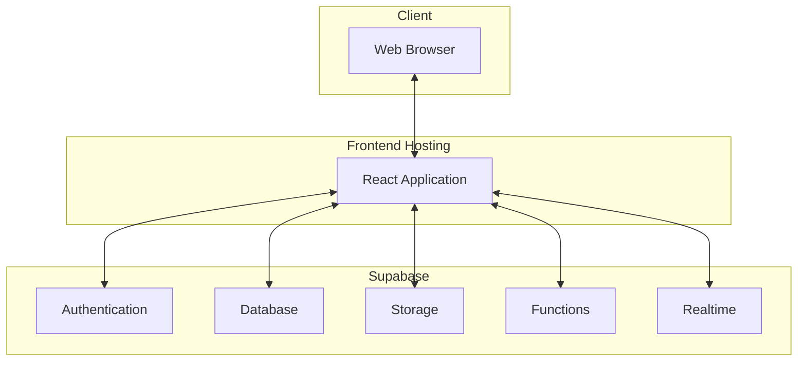

# Salary Management System - Deployment Strategy

This document outlines the deployment strategy for the Salary Management System, including deployment options, environment setup, CI/CD pipeline, and monitoring.

## Deployment Architecture

The Salary Management System consists of two main components:

1. **Frontend**: React application
2. **Backend**: Supabase services (Auth, Database, Storage, Functions)

### Architecture Diagram



## Deployment Options

### Frontend Deployment Options

| Option | Pros | Cons | Recommended For |
|--------|------|------|-----------------|
| **Vercel** | - Easy deployment<br>- Built-in CI/CD<br>- Preview deployments<br>- Edge network | - Potential cost for high traffic | Small to medium organizations |
| **Netlify** | - Easy deployment<br>- Built-in CI/CD<br>- Preview deployments<br>- Edge network | - Potential cost for high traffic | Small to medium organizations |
| **AWS S3 + CloudFront** | - Highly scalable<br>- Cost-effective for high traffic<br>- Enterprise-grade | - More complex setup<br>- Requires DevOps knowledge | Medium to large organizations |
| **Azure Static Web Apps** | - Easy deployment<br>- Built-in CI/CD<br>- Good integration with Azure services | - Tied to Azure ecosystem | Organizations using Azure |
| **Google Cloud Storage + CDN** | - Highly scalable<br>- Good integration with Google Cloud | - More complex setup<br>- Requires DevOps knowledge | Organizations using Google Cloud |

### Backend (Supabase) Deployment Options

| Option | Pros | Cons | Recommended For |
|--------|------|------|-----------------|
| **Supabase Cloud** | - Managed service<br>- Easy setup<br>- Built-in monitoring | - Limited customization<br>- Potential cost for high usage | Most organizations |
| **Self-hosted Supabase** | - Full control<br>- Customization<br>- Data sovereignty | - Complex setup<br>- Requires DevOps expertise<br>- Maintenance overhead | Large organizations with specific requirements |

## Environment Setup

### Development Environment

- **Frontend**: Local development server
- **Backend**: Supabase development project
- **Purpose**: Development and testing of new features
- **Data**: Sample data for development

### Staging Environment

- **Frontend**: Staging deployment (e.g., staging.example.com)
- **Backend**: Supabase staging project
- **Purpose**: Testing before production deployment
- **Data**: Anonymized copy of production data

### Production Environment

- **Frontend**: Production deployment (e.g., app.example.com)
- **Backend**: Supabase production project
- **Purpose**: Live application for end users
- **Data**: Real production data

## CI/CD Pipeline

### CI/CD Tools

- **GitHub Actions**: For GitHub repositories
- **GitLab CI/CD**: For GitLab repositories
- **Azure DevOps**: For organizations using Azure

### Pipeline Stages

#### 1. Build Stage

- Checkout code
- Install dependencies
- Build application
- Run linting
- Run unit tests

#### 2. Test Stage

- Run integration tests
- Run end-to-end tests
- Run performance tests (on scheduled basis)
- Run security scans

#### 3. Deploy Stage

- Deploy to appropriate environment
- Run smoke tests
- Notify team of deployment

### Example GitHub Actions Workflow

```yaml
name: CI/CD Pipeline

on:
  push:
    branches: [ main, develop ]
  pull_request:
    branches: [ main, develop ]

jobs:
  build:
    runs-on: ubuntu-latest
    steps:
      - uses: actions/checkout@v2
      - name: Setup Node.js
        uses: actions/setup-node@v2
        with:
          node-version: '16'
      - name: Install dependencies
        run: npm ci
      - name: Lint
        run: npm run lint
      - name: Build
        run: npm run build
      - name: Test
        run: npm test
      - name: Upload build artifacts
        uses: actions/upload-artifact@v2
        with:
          name: build
          path: build/

  deploy-staging:
    needs: build
    if: github.ref == 'refs/heads/develop'
    runs-on: ubuntu-latest
    steps:
      - name: Download build artifacts
        uses: actions/download-artifact@v2
        with:
          name: build
          path: build/
      - name: Deploy to Staging
        uses: netlify/actions/cli@master
        with:
          args: deploy --dir=build --prod
        env:
          NETLIFY_SITE_ID: ${{ secrets.STAGING_NETLIFY_SITE_ID }}
          NETLIFY_AUTH_TOKEN: ${{ secrets.NETLIFY_AUTH_TOKEN }}
      - name: Run Smoke Tests
        run: npm run test:smoke

  deploy-production:
    needs: build
    if: github.ref == 'refs/heads/main'
    runs-on: ubuntu-latest
    steps:
      - name: Download build artifacts
        uses: actions/download-artifact@v2
        with:
          name: build
          path: build/
      - name: Deploy to Production
        uses: netlify/actions/cli@master
        with:
          args: deploy --dir=build --prod
        env:
          NETLIFY_SITE_ID: ${{ secrets.PRODUCTION_NETLIFY_SITE_ID }}
          NETLIFY_AUTH_TOKEN: ${{ secrets.NETLIFY_AUTH_TOKEN }}
      - name: Run Smoke Tests
        run: npm run test:smoke
```

## Deployment Process

### Feature Development Workflow

1. Developer creates feature branch from `develop`
2. Developer implements feature and writes tests
3. Developer creates pull request to `develop`
4. CI/CD pipeline runs tests
5. Code review is performed
6. Pull request is merged to `develop`
7. CI/CD pipeline deploys to staging environment
8. QA team tests feature in staging environment

### Release Workflow

1. Create release branch from `develop`
2. Fix any release-specific issues
3. Create pull request to `main`
4. CI/CD pipeline runs tests
5. Code review is performed
6. Pull request is merged to `main`
7. CI/CD pipeline deploys to production environment
8. Tag release with version number

## Environment Configuration

### Environment Variables

Environment variables should be used to configure the application for different environments:

```
# Frontend Environment Variables
REACT_APP_SUPABASE_URL=https://your-project.supabase.co
REACT_APP_SUPABASE_ANON_KEY=your-anon-key
REACT_APP_API_URL=https://api.example.com
REACT_APP_ENVIRONMENT=production
```

### Configuration Management

- **Development**: `.env.development` file
- **Staging**: Environment variables in CI/CD pipeline
- **Production**: Environment variables in CI/CD pipeline

## Database Migrations

### Migration Strategy

1. Create migration scripts for schema changes
2. Test migrations in development environment
3. Apply migrations to staging environment
4. Apply migrations to production environment

### Example Migration Script

```sql
-- Migration: Add new column to employees table
ALTER TABLE employees ADD COLUMN emergency_contact TEXT;
```

## Backup and Disaster Recovery

### Backup Strategy

- **Database**: Daily automated backups
- **Storage**: Regular backups of uploaded files
- **Retention**: 30 days of backups

### Disaster Recovery Plan

1. **Identify Incident**: Determine the nature and scope of the incident
2. **Containment**: Prevent further damage
3. **Recovery**: Restore from backups if necessary
4. **Verification**: Ensure system is functioning correctly
5. **Post-Incident Review**: Analyze what happened and how to prevent it

## Monitoring and Logging

### Monitoring Tools

- **Application Monitoring**: Sentry, LogRocket
- **Performance Monitoring**: Lighthouse, Google Analytics
- **Server Monitoring**: Supabase Dashboard, Grafana

### Logging Strategy

- **Frontend Logs**: Console logs in development, Sentry in production
- **Backend Logs**: Supabase logs
- **Log Retention**: 30 days

### Alerting

- **Error Alerts**: Notify team of application errors
- **Performance Alerts**: Notify team of performance degradation
- **Security Alerts**: Notify team of security incidents

## Scaling Strategy

### Frontend Scaling

- Use CDN for static assets
- Implement code splitting
- Optimize bundle size
- Use caching strategies

### Backend Scaling

- Monitor database performance
- Optimize queries
- Use connection pooling
- Consider upgrading Supabase plan for higher limits

## Security Considerations

### SSL/TLS

- Use HTTPS for all environments
- Enforce HTTPS with redirects
- Use modern TLS protocols

### Authentication

- Implement proper authentication with Supabase Auth
- Use secure password policies
- Implement multi-factor authentication for admin users

### Data Protection

- Implement row-level security in Supabase
- Encrypt sensitive data
- Implement proper access controls

## Rollback Strategy

### Rollback Process

1. Identify issue in production deployment
2. Decide to rollback
3. Deploy previous version
4. Verify system functionality
5. Investigate root cause

### Rollback Automation

- Keep previous deployment artifacts
- Implement one-click rollback in CI/CD pipeline
- Test rollback process regularly

## Compliance and Auditing

### Compliance Requirements

- Identify relevant regulations (e.g., GDPR, HIPAA)
- Implement required security measures
- Document compliance efforts

### Auditing

- Log all system changes
- Log all data access
- Regularly review logs for suspicious activity

## Documentation

### Deployment Documentation

- Document deployment process
- Document environment setup
- Document rollback procedures

### Runbooks

- Create runbooks for common operational tasks
- Create incident response procedures
- Keep documentation up to date

## Training

### Team Training

- Train development team on deployment process
- Train operations team on monitoring and incident response
- Conduct regular drills for incident response

## Conclusion

This deployment strategy provides a comprehensive approach to deploying, maintaining, and scaling the Salary Management System. By following this strategy, we can ensure a reliable, secure, and performant application for end users.