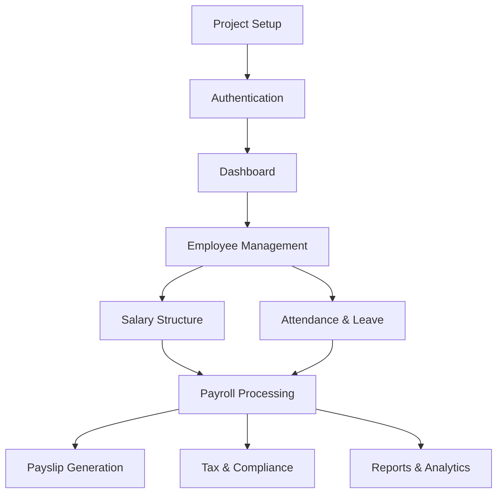

# Salary Management System - Implementation Plan

This document outlines the detailed implementation plan for each module of the salary management system. It provides a step-by-step approach to building the application.

## 1. Project Setup and Configuration

### 1.1. Initialize React Project
- Create a new React project using Create React App or Vite
- Set up project structure as defined in project-structure.md
- Configure ESLint and Prettier for code quality

### 1.2. Install Dependencies
- Core: React, React Router, React Query
- UI: Ant Design, Material UI, Styled Components
- Forms: Formik/React Hook Form, Yup
- Charts: Chart.js/Recharts
- PDF: React-PDF
- Utilities: date-fns, lodash
- Testing: Jest, React Testing Library

### 1.3. Supabase Setup
- Create a new Supabase project
- Set up database tables according to database-schema.md
- Configure authentication
- Set up storage buckets
- Create initial row-level security policies

### 1.4. Environment Configuration
- Create .env files for development and production
- Configure Supabase client
- Set up API utilities

## 2. Authentication Module

### 2.1. Supabase Auth Integration
- Configure Supabase Auth client
- Create authentication context and hooks
- Implement protected routes

### 2.2. Login Page
- Design login form
- Implement form validation
- Connect to Supabase Auth
- Add error handling and loading states

### 2.3. Password Management
- Implement forgot password functionality
- Create password reset flow
- Add change password feature

## 3. Home Page and Admin Dashboard

### 3.1. Home Page
- Design landing page with school logo
- Create admin login button
- Implement responsive layout

### 3.2. Dashboard Layout
- Create main layout with header, sidebar, and content area
- Implement responsive sidebar
- Add navigation menu with icons
- Create breadcrumb navigation

### 3.3. Dashboard Overview
- Design dashboard cards for key metrics
- Implement charts for salary trends
- Create alerts/reminders section
- Add department-wise payroll visualization

## 4. Employee Management Module

### 4.1. Employee List
- Create employee list page with search and filters
- Implement pagination
- Add sorting functionality
- Create quick actions (view, edit, delete)

### 4.2. Employee Form
- Design add/edit employee form
- Implement form validation
- Add department and role selection
- Create bank details section
- Implement document upload

### 4.3. Employee Details
- Design employee profile view
- Create tabs for different sections (personal, salary, documents)
- Implement document preview
- Add salary history view

### 4.4. Document Management
- Create document upload component
- Implement document preview
- Add document verification functionality
- Create document expiry alerts

## 5. Salary Structure Management

### 5.1. Salary Components
- Create component list with CRUD operations
- Implement component type selection (earning, deduction)
- Add taxable flag and percentage options
- Create component details view

### 5.2. Salary Structures
- Design structure list with search and filters
- Create structure form with component selection
- Implement drag-and-drop for ordering components
- Add structure preview with calculations

### 5.3. Employee Salary Assignment
- Create interface for assigning structures to employees
- Implement effective date functionality
- Add salary revision history
- Create bulk assignment feature

## 6. Payroll Processing

### 6.1. Payroll Calculation
- Implement salary calculation logic
- Create attendance integration
- Add overtime and leave deduction logic
- Implement tax calculation

### 6.2. Payroll List
- Design payroll list with filters (month, year, department)
- Create payroll summary view
- Implement status tracking (pending, processed, paid)
- Add bulk actions

### 6.3. Payroll Approval
- Create approval workflow
- Implement multi-level approval if needed
- Add comments and rejection reasons
- Create approval history

### 6.4. Payroll Finalization
- Implement finalization process
- Create payment tracking
- Add transaction reference
- Implement payment method selection

## 7. Payslip Generation

### 7.1. Payslip Template
- Design payslip template with company branding
- Create customizable sections
- Implement dynamic calculations
- Add signature and footer

### 7.2. Payslip Generation
- Create individual payslip generation
- Implement bulk generation
- Add preview functionality
- Create download option

### 7.3. Payslip Distribution
- Implement email functionality
- Create bulk email option
- Add email tracking
- Implement notification system

## 8. Attendance and Leave Integration

### 8.1. Attendance Management
- Create attendance list with filters
- Implement manual attendance entry
- Add bulk upload option
- Create attendance summary

### 8.2. Leave Management
- Design leave type configuration
- Create leave application form
- Implement approval workflow
- Add leave balance tracking

### 8.3. Integration with Payroll
- Create attendance-payroll linkage
- Implement leave deduction logic
- Add overtime calculation
- Create attendance regularization

## 9. Tax and Compliance

### 9.1. Tax Configuration
- Create tax slab configuration
- Implement tax regime selection
- Add financial year settings
- Create tax component mapping

### 9.2. Tax Calculation
- Implement TDS calculation logic
- Create tax projection
- Add investment declaration
- Implement proof submission

### 9.3. Compliance Reports
- Create PF reports
- Implement ESI reports
- Add PT compliance
- Create statutory reports

### 9.4. Form 16 Generation
- Design Form 16 template
- Implement data mapping
- Create generation workflow
- Add digital signature

## 10. Reports and Analytics

### 10.1. Standard Reports
- Create monthly payroll report
- Implement department-wise salary report
- Add employee-wise salary report
- Create statutory reports

### 10.2. Custom Reports
- Design report builder
- Implement parameter selection
- Add column customization
- Create scheduling option

### 10.3. Analytics Dashboard
- Design analytics dashboard
- Create trend analysis
- Implement department comparisons
- Add cost center analysis

### 10.4. Export Functionality
- Implement Excel export
- Create PDF export
- Add CSV export
- Implement scheduled exports

## 11. Deployment and DevOps

### 11.1. Build Configuration
- Set up production build process
- Implement code splitting
- Add performance optimizations
- Create build scripts

### 11.2. Deployment Setup
- Configure hosting platform (Vercel/Netlify)
- Set up environment variables
- Implement CI/CD pipeline
- Create deployment documentation

### 11.3. Monitoring and Logging
- Set up error tracking
- Implement performance monitoring
- Add user activity logging
- Create alert system

## 12. Testing and Quality Assurance

### 12.1. Unit Testing
- Create component tests
- Implement service tests
- Add utility function tests
- Create hook tests

### 12.2. Integration Testing
- Implement feature workflow tests
- Create form submission tests
- Add API integration tests
- Implement authentication flow tests

### 12.3. End-to-End Testing
- Create critical user journey tests
- Implement cross-browser testing
- Add responsive design tests
- Create performance tests

### 12.4. Bug Fixing and Refinement
- Address identified issues
- Implement performance improvements
- Add accessibility enhancements
- Create final polishing

## 13. Documentation

### 13.1. User Documentation
- Create user manual
- Implement in-app help
- Add tooltips and guides
- Create FAQ section

### 13.2. Developer Documentation
- Create API documentation
- Implement code comments
- Add setup instructions
- Create contribution guidelines

### 13.3. Deployment Documentation
- Create deployment guide
- Implement environment setup
- Add troubleshooting section
- Create maintenance instructions

## Implementation Timeline

| Phase | Modules | Estimated Duration |
|-------|---------|-------------------|
| 1 | Project Setup, Authentication | 1 week |
| 2 | Home Page, Dashboard | 1 week |
| 3 | Employee Management | 2 weeks |
| 4 | Salary Structure Management | 2 weeks |
| 5 | Payroll Processing | 2 weeks |
| 6 | Payslip Generation | 1 week |
| 7 | Attendance and Leave | 2 weeks |
| 8 | Tax and Compliance | 2 weeks |
| 9 | Reports and Analytics | 2 weeks |
| 10 | Testing, Deployment, Documentation | 2 weeks |

**Total Estimated Duration: 17 weeks**

## Development Approach

### Iterative Development
- Develop core features first
- Implement MVP for each module
- Gather feedback and refine
- Add advanced features

### Module Dependencies

### Testing Strategy
- Unit tests for components and services
- Integration tests for feature workflows
- End-to-end tests for critical user journeys
- Performance testing for database queries

### Code Review Process
- Pull request for each feature
- Code review by at least one team member
- Automated tests must pass
- Manual testing for UI components