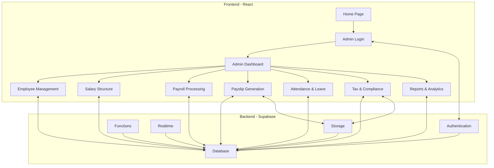

# Salary Management System - System Architecture

## Overview

The Salary Management System is a web application built using React for the frontend and Supabase for backend services. The application follows a modern architecture pattern with a clear separation of concerns between the frontend and backend.

## Architecture Diagram

## Technology Stack

### Frontend
- **React**: Core library for building the user interface
- **Ant Design**: Component library for UI elements
- **Material UI**: Theming and styling
- **React Router**: For navigation and routing
- **React Query**: For data fetching and caching
- **Chart.js/Recharts**: For data visualization
- **React-PDF**: For PDF generation
- **Formik/React Hook Form**: For form handling
- **Yup**: For form validation

### Backend (Supabase)
- **Authentication**: User management and authentication
- **Database**: PostgreSQL database for data storage
- **Storage**: File storage for documents and payslips
- **Functions**: Serverless functions for complex operations
- **Realtime**: Real-time subscriptions for live updates

## Component Structure

### Frontend Components

1. **Authentication**
   - Login
   - Forgot Password
   - Reset Password

2. **Layout**
   - MainLayout
   - Sidebar
   - Header
   - Footer

3. **Dashboard**
   - Overview
   - Statistics
   - Charts
   - Alerts

4. **Employee Management**
   - EmployeeList
   - EmployeeForm
   - EmployeeDetails
   - DocumentUpload

5. **Salary Structure**
   - SalaryStructureList
   - SalaryStructureForm
   - ComponentList
   - ComponentForm

6. **Payroll Processing**
   - PayrollList
   - PayrollForm
   - PayrollApproval
   - PayrollSummary

7. **Payslip Generation**
   - PayslipList
   - PayslipPreview
   - PayslipEmail
   - BulkGeneration

8. **Attendance & Leave**
   - AttendanceList
   - AttendanceForm
   - LeaveList
   - LeaveForm

9. **Tax & Compliance**
   - TaxCalculation
   - TaxDeductions
   - ComplianceReports
   - Form16Generation

10. **Reports & Analytics**
    - ReportList
    - ReportGenerator
    - AnalyticsDashboard
    - ExportOptions

### Backend Structure (Supabase)

1. **Authentication**
   - User registration and login
   - Role-based access control
   - Password reset

2. **Database Tables**
   - As defined in the database schema

3. **Storage Buckets**
   - employee_documents
   - payslips
   - tax_documents
   - reports

4. **Functions**
   - calculateSalary
   - generatePayslip
   - calculateTax
   - generateReports

5. **Policies**
   - Row-level security policies for data access
   - Storage access policies

## Data Flow

1. **Authentication Flow**
   - User enters credentials on the login page
   - Credentials are sent to Supabase Auth
   - Upon successful authentication, JWT token is returned
   - Token is stored in local storage
   - User is redirected to the dashboard

2. **Employee Management Flow**
   - Admin creates/edits employee details
   - Data is validated on the frontend
   - Data is sent to Supabase database
   - Documents are uploaded to Supabase storage
   - Real-time updates are reflected in the UI

3. **Payroll Processing Flow**
   - Admin initiates payroll calculation
   - System fetches employee data, salary structure, attendance
   - Calculations are performed (can be in Supabase functions)
   - Results are stored in the database
   - Admin reviews and approves payroll
   - Payslips are generated and stored

4. **Reporting Flow**
   - Admin selects report type and parameters
   - System queries the database
   - Data is processed and formatted
   - Charts and tables are generated
   - Reports can be exported to PDF/Excel

## Security Considerations

1. **Authentication**
   - JWT-based authentication
   - Role-based access control
   - Secure password policies

2. **Data Security**
   - Row-level security in Supabase
   - Data encryption for sensitive information
   - Secure API endpoints

3. **File Security**
   - Access control for document storage
   - Secure file upload and download

4. **Frontend Security**
   - Input validation
   - Protection against XSS
   - CSRF protection

## Deployment Architecture

The application can be deployed using various strategies:

1. **Frontend**
   - Static hosting on Vercel, Netlify, or AWS S3
   - CDN for improved performance

2. **Backend**
   - Supabase hosted service
   - Custom PostgreSQL deployment for enterprise needs

3. **CI/CD**
   - GitHub Actions for automated testing and deployment
   - Version control and release management

## Scalability Considerations

1. **Database**
   - Connection pooling
   - Indexing for performance
   - Query optimization

2. **Storage**
   - CDN for file delivery
   - Compression for documents

3. **Functions**
   - Serverless scaling
   - Caching strategies

## Monitoring and Logging

1. **Application Monitoring**
   - Error tracking
   - Performance monitoring
   - User activity logging

2. **Database Monitoring**
   - Query performance
   - Connection monitoring
   - Storage usage

## Future Extensibility

The architecture is designed to be extensible for future features:

1. **Mobile Application**
   - React Native app using the same backend
   - Progressive Web App (PWA) capabilities

2. **Integration**
   - API endpoints for third-party integration
   - Webhook support for events

3. **Advanced Features**
   - Machine learning for salary predictions
   - Automated compliance checks
   - Advanced reporting and analytics